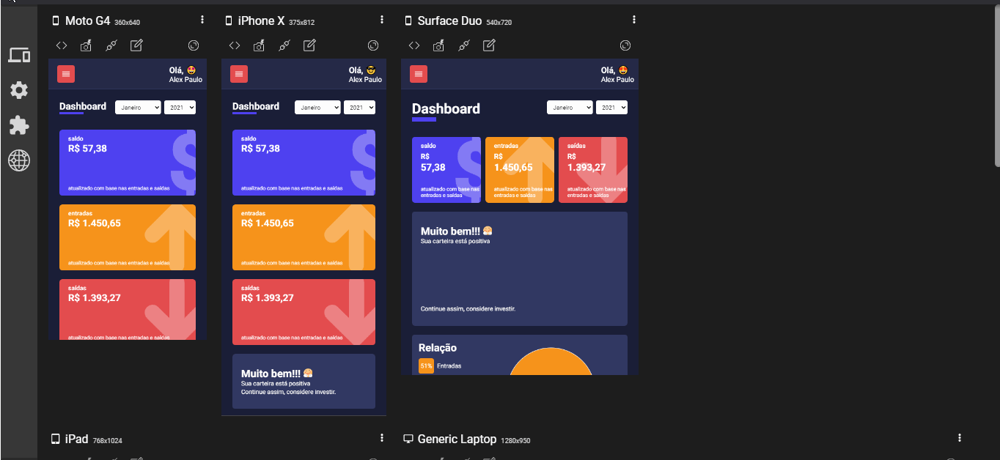

# Dashboard de controle financeiro My Wallet

# Sobre o projeto

Dashboard desenvolvido em **ReactJs** com **TypeScript** inteiramente componentizado com **componentes puros**. O Dashboard foi desenvolvido através do curso [**React e TypeScript: desenvolvendo um Dashboard**](https://www.udemy.com/course/react-e-typescript/)

  

Não há banco de dados. Os dados são carregados de 2 arquivos que contém arrays simulando os repositórios de dados.

### Layout & Componentes Responsivos

  

### Layout & Componentes Responsivos

- [x] Para os gráficos, foi utilizada a bibliteca [**Recharts**](http://recharts.org/en-US) que é opensource.
- [x] Para efeito de número crescendo foi utilizada a bibliteca [**React CountUp**](https://www.npmjs.com/package/react-countup).

### Certificado de conclusão obtido

  

  <small>Alex Paulo Tadeu Vieira - 2021</small>

